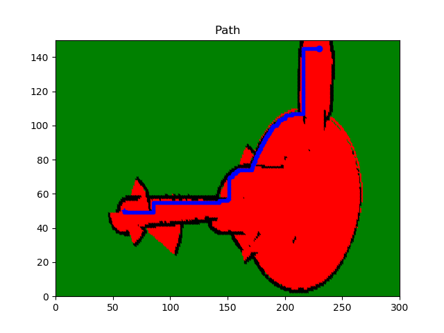

[](https://www.udacity.com/robotics)

# RoboND-A-Visualization
You will visualize the shortest path for the robot to travel through the generated image

### Instruction

STEP 1 : modeling_the_problem
STEP 2 : BFS_expansion_list
STEP 3 : BFS_expansion_vector
STEP 4 : BFS_Shortest_Path
STEP 5 : A*_Shortest_Path
STEP 6 : A*_Real-World_Map
FINAL STEP : RoboND-A-Visualization

Go to the FINAL STEP folder to see the original README and repo


### Compiling
```sh
$ cd ...... RoboND-A-Visualization
$ rm -rf Images/* #Delete the folder content and not the folder itself!
$ g++ main.cpp -o app -std=c++11 -I/usr/include/python2.7 -lpython2.7
```

### Running
```sh
$ ./app
```

Now, wait for the program to generate the path!

### Generated Path



